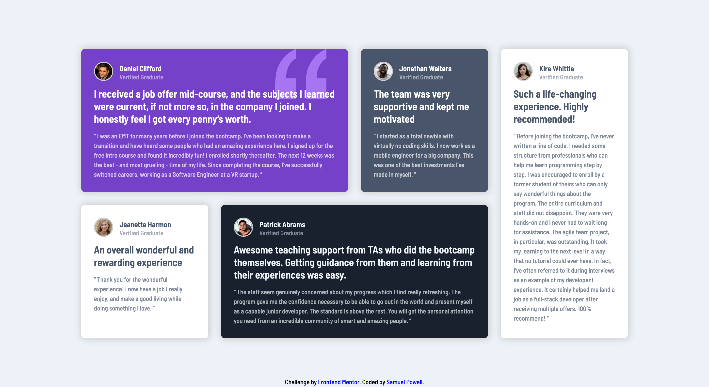

# Frontend Mentor - Testimonials grid section solution

This is a solution to the [Testimonials grid section challenge on Frontend Mentor](https://www.frontendmentor.io/challenges/testimonials-grid-section-Nnw6J7Un7).

## Table of contents

- [Overview](#overview)
  - [The challenge](#the-challenge)
  - [Screenshot](#screenshot)
  - [Links](#links)
- [My process](#my-process)
  - [Built with](#built-with)
  - [What I learned](#what-i-learned)
  - [Continued development](#continued-development)
  - [Useful resources](#useful-resources)
- [Author](#author)

## Overview

### The challenge

Users should be able to:

- View the optimal layout for the site depending on their device's screen size

### Screenshot

### Links

- Solution URL: [Add solution URL here](https://your-solution-url.com)
- Live Site URL: [Add live site URL here](https://your-live-site-url.com)

## My process

### Built with

- Semantic HTML5 markup
- CSS custom properties
- Flexbox
- CSS Grid
- Mobile-first workflow

### What I learned

The objective of this task for me was to learn CSS Grid, as I have always relied on Flexbox until now. I believe I now grasp the basics, thanks to videos by [Kevin Powell](https://www.youtube.com/kepowob).

### Continued development

In the main resource that I used (linked below), the video ends with grid template areas. I did not use these for this particular challenge as I just wanted to get my head around CSS Grid. However I will look more into this property the next time I use CSS Grid.

### Useful resources

- [Kevin Powell - Learn CSS Grid the easy way](https://www.youtube.com/watch?v=rg7Fvvl3taU) - This was the main resource I used. He is doing the same challenge, but I did not use his starter code.

## Author

- Website - [Samuel Powell](https://samuelpowell.ie/)
- Frontend Mentor - [@spowell0162](https://www.frontendmentor.io/profile/spowell0162)
- Twitter - [@samuel_powelll](https://twitter.com/samuel_powelll)

